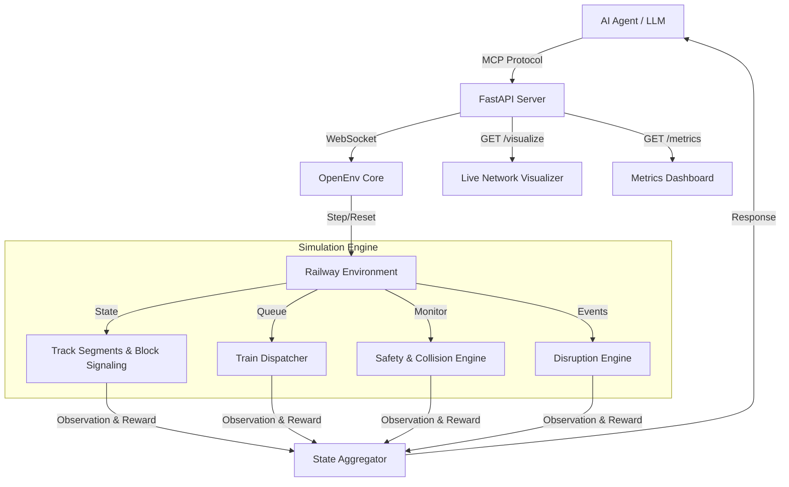

<div align="center">

# 🚂 Railway Traffic Controller Gym Environment

**An advanced, OpenEnv-compatible reinforcement learning simulation for AI-driven railway traffic management, collision avoidance, and dynamic dispatching.**

[](https://github.com/facebookresearch/openenv)
[](https://python.org)
[](https://fastapi.tiangolo.com)
[](https://docker.com)
[](https://huggingface.co/spaces/omkargadekar-dev/railway-controller)
[](LICENSE)

[Live Demo](https://omkargadekar-dev-railway-controller.hf.space/) •
[API Documentation](https://omkargadekar-dev-railway-controller.hf.space/docs) •
[Report an Issue](https://github.com/HoneyBadger-010/railway_controller_gym_env/issues)

</div>

---

## 📖 Overview

The **Railway Traffic Controller** is a high-fidelity simulation environment designed for training and evaluating reinforcement learning (RL) agents in complex infrastructure management. It models the critical responsibilities of human railway traffic controllers—making split-second decisions to manage train movements, signals, and routing across intricate rail networks.

Our objective is to provide a robust benchmark for AI agents, enabling them to safely prevent collisions and optimize traffic flow under strict constraints, dynamic priorities, and stochastic disruptions.

---

## 🎯 Problem Statement & Applications

Railway networks require precise coordination. A single miscalculated signal can cascade into catastrophic collisions or multi-hour gridlocks. This environment serves as a testbed for solving these challenges autonomously.

**Key Research & Industry Applications:**
- **Automated Dispatching:** Optimize schedules for metro, freight, and high-speed rail systems.
- **Safety Critical Systems:** Train RL agents to enforce block signaling and collision avoidance protocols.
- **Logistics Optimization:** Minimize network-wide delays while strictly adhering to dynamic priority rules.
- **Infrastructure Simulation:** Stress-test network capacity and plan future expansions under simulated demand.

---

## ✨ Core Features

### 🛡️ Authentic Block Signaling Safety System
The environment implements a realistic block signaling architecture, enforcing the fundamental safety mechanism of modern rail networks:
- **🟢 GREEN**: Proceed (next segment is clear).
- **🟡 YELLOW**: Caution (mandatory 1-step wait, automatically clears).
- **🔴 RED**: Stop (entry to the next segment is strictly prohibited).
- *Strict Constraints:* Only one train is permitted per track block. Signal violations or concurrent block occupation result in critical failure (collision).

### 🚄 Dynamic Priority Dispatching
Trains are governed by a hierarchical priority system, simulating real-world scheduling complexity:

| Priority Level | Classification | Identifier | Operational Behavior |
|:---:|---|:---:|---|
| **3** | High-Speed | 🔴 | Absolute right-of-way; strict schedule adherence required. |
| **2** | Express | 🟠 | Standard priority; yields only to High-Speed traffic. |
| **1** | Regular | 🟢 | Standard scheduling; yields to all higher-priority traffic. |

*Dynamic Boosting:* Delayed trains receive priority boosts (`effective_priority = base_priority + min(delay × 0.1, 0.5)`) to facilitate schedule recovery.

### 🌧️ Stochastic Weather & Disruptions
To model real-world unpredictability, the environment introduces stochastic weather delays during peak scenarios, forcing the agent to dynamically adapt its routing and signal management strategies.

### 🧠 Integrated AI Control Tooling
The environment exposes a comprehensive Model Context Protocol (MCP) suite, including a `get_control_suggestions()` heuristic that provides AI agents with collision risk assessments and schedule recovery hints.

---

## 🏁 Evaluation Tasks

The environment provides progressive difficulty benchmarks to evaluate agent capability:

| Task Name | Difficulty | Trains | Steps | Objective |
|---|---|---|---|---|
| **Basic Control** | Easy | 2 | 30 | Coordinate signals at a shared crossing to prevent collisions. |
| **Junction Management** | Medium | 4 | 50 | Sequence three trains through a congested junction by priority. |
| **Express Priority** | Medium-Hard | 5 | 40 | Resolve cascading conflicts across a three-junction linked network. |
| **Rush Hour** | Hard | 6 | 80 | Manage peak-hour traffic across 4 junctions with stochastic weather delays. |

---

## 🛠️ MCP Tool Suite

Agents interact with the simulation via a standardized set of tools:

| Category | Tool Name | Description |
|---|---|---|
| **Control** | `set_signal` | Modify signal states (red/yellow/green) to block or allow access. |
| | `hold_train` | Force a train to halt at its current position. |
| | `release_train` | Release a previously held train. |
| | `route_train` | Direct a train through a specific junction segment. |
| | `trigger_emergency`| Simulate hardware malfunctions or track failures. |
| **Observation** | `get_status` | Retrieve a comprehensive snapshot of the network state. |
| | `get_segment_occupancy`| Access the real-time block occupancy mapping. |
| | `get_delay_status` | Monitor schedule adherence and delay metrics. |
| **Analysis** | `get_collision_warnings`| Identify imminent collision risks and violations. |
| | `get_control_suggestions`| Request heuristic-based routing and signal recommendations. |
| | `detect_deadlocks` | Identify circular wait conditions and gridlocks. |
| | `get_trace` | Export the episode's step-by-step decision log. |

---

## 📊 Evaluation & Reward Function

Agents are evaluated holistically across four dimensions: **Arrivals (Punctuality)**, **Safety (Collision Avoidance)**, **Priority Adherence**, and **Network Efficiency**. 

**Reward Design:**
- **On-time arrival:** `+0.2 × priority` (Granted upon successful destination reach).
- **Delay penalty:** `-0.05 × delay_steps` (Capped at maximum limit).
- **Waiting penalty:** `-0.01` (Applied per step, per stationary train).
- **Collision:** `-0.5` (Immediate termination with penalty).

---

## 🚀 Getting Started

### Option 1: Docker (Recommended)
```bash
# Build the standardized container
docker build -t railway-controller:latest .

# Launch the API server
docker run -p 8000:8000 railway-controller:latest

# Verify health status
curl http://localhost:8000/health
```

### Option 2: Local Setup (`uv`)
```bash
# Sync dependencies via uv
uv sync

# Initialize the FastAPI server
uv run uvicorn server.app:app --host 0.0.0.0 --port 8000

# Execute baseline inference
uv run python inference.py
```

### Option 3: Python Client Integration
```python
from railway_controller import RailwayControllerEnv

async with RailwayControllerEnv(base_url="http://localhost:8000") as env:
    # Initialize the environment with a specific task
    await env.reset(task_name="basic_control")
    
    # Observe the state
    status = await env.call_tool("get_status")
    
    # Take action: Enforce safety at junction
    await env.call_tool("set_signal", segment_id="J1-CROSS", state="red")
    await env.call_tool("hold_train", train_id="T2", reason="Yielding to High-Speed T1")
```

---

## 🏗️ Architecture



---

## 📋 OpenEnv Compliance Verification

- ✅ **Environment Variables**: Native support for `API_BASE_URL`, `MODEL_NAME`, `HF_TOKEN`, `LOCAL_IMAGE_NAME`.
- ✅ **Structured Logging**: Fully compliant `[START]` → `[STEP]` → `[END]` telemetry.
- ✅ **API Standard**: Built on `openai.OpenAI` for seamless LLM integration.
- ✅ **Deployment**: Unified Dockerfile for local execution and HuggingFace Spaces.
- ✅ **Validation**: Passes `openenv validate` (`[OK] Ready for multi-mode deployment`).

---

<div align="center">

### Built for the Future of Autonomous Rail

[](https://github.com/HoneyBadger-010/railway_controller_gym_env)
[](https://huggingface.co/spaces/omkargadekar-dev/railway-controller)

*Licensed under the [MIT License](LICENSE).*

</div>