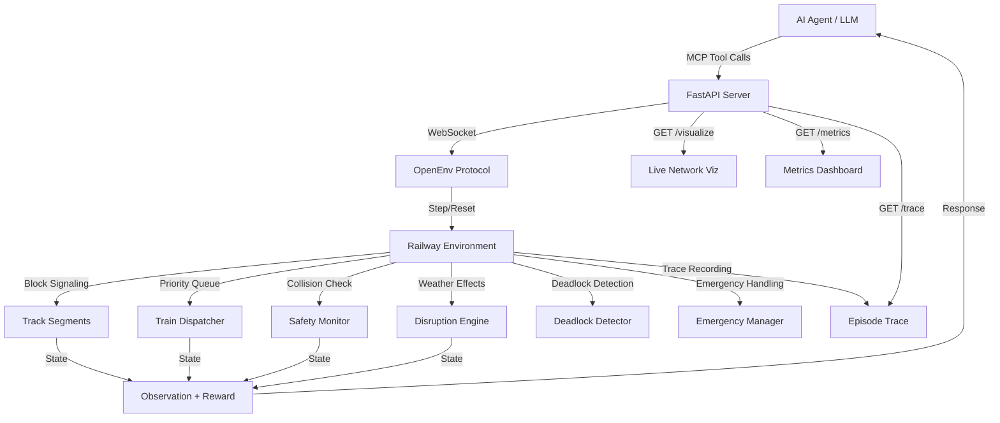

<div align="center">

# 🚂 Railway Traffic Controller

### *AI-Powered Railway Traffic Management System*

[](https://github.com/facebookresearch/openenv)
[](https://python.org)
[](https://fastapi.tiangolo.com)
[](https://docker.com)
[](https://huggingface.co/spaces/omkargadekar-dev/railway-controller)
[](LICENSE)

---

*A high-fidelity simulation of real-world railway traffic control — where an AI agent manages train movements, signals, and junction routing to prevent collisions and minimize delays across increasingly complex rail networks.*

[🚀 Live Demo](https://omkargadekar-dev-railway-controller.hf.space/) · [📖 API Docs](https://omkargadekar-dev-railway-controller.hf.space/) · [🐛 Report Bug](https://github.com/HoneyBadger-010/railway_controller_gym_env/issues)

</div>

---

## 🎯 The Problem We're Solving

Every day, **thousands of trains** share tracks, junctions, and stations worldwide. A single miscalculated signal or poorly-timed route change can cascade into catastrophic collisions, multi-hour delays, or gridlocked networks.

**Railway traffic controllers** are the unsung heroes who prevent this chaos — making split-second decisions under immense pressure, juggling competing priorities (express vs. local trains), weather disruptions, and network congestion.

> 💡 **Our mission:** Build an AI agent that can match — and eventually surpass — human controllers at managing complex rail networks safely and efficiently.

---

## 🌍 Real-World Impact & Applications

| Domain | Application |
|--------|-------------|
| 🚆 **Rail Operations** | Automate dispatching decisions for metro systems, freight networks, and high-speed rail |
| 🛡️ **Safety Systems** | Train AI to enforce block signaling, prevent collisions, and handle emergency scenarios |
| 📊 **Logistics Optimization** | Minimize network-wide delays while respecting priority schedules |
| 🎓 **RL Research** | A challenging multi-agent, multi-objective benchmark for reinforcement learning |
| 🏗️ **Infrastructure Planning** | Simulate network expansions and test capacity under future demand |

---

## ✨ Key Features

### 🛡️ Block Signaling Safety System
Our environment implements **real-world block signaling** — the #1 safety mechanism in modern railways:

```
🟢 GREEN  → Proceed (next segment clear)
🟡 YELLOW → Caution (wait 1 step, auto-clears)  
🔴 RED    → Stop (do not enter next segment)
```

- **One train per block** — each track segment allows only ONE train at a time
- **Collision detection** — two trains in the same block = critical failure
- **Signal-controlled entry** — signals gate access to downstream blocks

### 🚄 Priority-Based Train Dispatching

| Priority | Type | Badge | Behavior |
|:--------:|------|:-----:|----------|
| 3 | High-Speed | 🔴 | Right-of-way at all junctions, tight schedules |
| 2 | Express | 🟠 | Priority over regular, moderate schedules |
| 1 | Regular | 🟢 | Standard scheduling, yields to higher priority |

Late trains get a **dynamic priority boost** to recover schedules:
```
effective_priority = base_priority + min(delay × 0.1, 0.5)
```

### 🌧️ Weather Disruption System
Rush-hour scenarios include **stochastic weather effects**:
- 25% chance per train per step of weather delay
- Simulates real-world disruptions (fog, rain, ice)
- Agent must adapt plans dynamically

### 🧠 AI-Powered Control Suggestions
Built-in `get_control_suggestions()` tool provides intelligent recommendations:
- Collision risk assessment for each junction
- Priority-aware scheduling hints
- Delay recovery strategies

---

## 🏁 Challenge Tasks

<table>
<tr>
<td width="50%">

### 🟢 Task 1: Basic Control
**Difficulty:** Easy · **Trains:** 2 · **Steps:** 30

Simple track with one shared crossing. Coordinate signal timing so both trains pass through safely.

> *"Can you prevent two trains from crashing?"*

</td>
<td width="50%">

### 🟡 Task 2: Junction Management
**Difficulty:** Medium · **Trains:** 4 · **Steps:** 50

Two junctions, four trains (including one express). Must sequence three trains through the same junction by priority.

> *"Can you prioritize and sequence traffic at a busy junction?"*

</td>
</tr>
<tr>
<td width="50%">

### 🟠 Task 3: Express Priority
**Difficulty:** Medium-Hard · **Trains:** 5 · **Steps:** 40

Three-junction chain with cascading conflicts. Two trains start from the same station, creating immediate conflict.

> *"Can you handle cascading conflicts across linked junctions?"*

</td>
<td width="50%">

### 🔴 Task 4: Rush Hour
**Difficulty:** Hard · **Trains:** 6 · **Steps:** 80

Complex 4-junction network with weather effects. Multiple crossing conflicts with random disruptions.

> *"Can you manage peak-hour chaos with weather delays?"*

</td>
</tr>
</table>

---

## 🗺️ Network Architecture

### Express Priority Network (Task 3)
```
Station A ──[A-J1]──→ J1 ──[J1-B]──→ Station B
                       │
                    [J1-J2]
                       │
Station C ──[C-J2]──→ J2 ──[J2-D]──→ Station D
                       │
                    [J2-J3]
                       │
Station E ──[E-J3]──→ J3 ──[J3-F]──→ Station F
```

### Rush Hour Network (Task 4)
```
        Station A ──[A-J1]──→ J1 ──[J1-B]──→ Station B
            │                  │                  │
         [A-J2]            [J1-J2]            [B-J3]
            │                  │                  │
            J2 ──[J2-C]──→ Station C ──[C-J3]──→ J3
            │                                     │
         [J2-D]                               [J3-E]
            │                                     │
        Station D ←──[D-J4]── J4 ←──[J4-E]── Station E
                               │
                           [J4-F]
                               │
                          Station F
```

---

## 🛠️ MCP Tool Suite

| Tool | Description | Use Case |
|:----:|-------------|----------|
| 🚦 `set_signal` | Control signal state (red/yellow/green) | Block dangerous segments |
| ✋ `hold_train` | Hold a train at current position | Let higher-priority trains pass |
| ▶️ `release_train` | Release a held train | Resume service after conflict resolved |
| 🔀 `route_train` | Route through a specific segment | Redirect trains at junctions |
| 📊 `get_status` | Full network status snapshot | Understand the current situation |
| ⚠️ `get_collision_warnings` | Active collision risks | Identify imminent dangers |
| 🗺️ `get_segment_occupancy` | Block occupancy map | See where every train is |
| 🧠 `get_control_suggestions` | AI-powered recommendations | Get expert guidance |
| ⏱️ `get_delay_status` | Train delay report | Track schedule adherence |
| 🔄 `detect_deadlocks` | Circular wait detection | Find and break deadlocked trains |
| 🚨 `trigger_emergency` | Simulate track failure/signal malfunction | Test emergency response |
| 📝 `get_trace` | Episode replay log | Step-by-step decision analysis |

---

## 📊 Scoring System

Each task is graded on multiple criteria with weighted components:

| Component | 🟢 Basic | 🟡 Junction | 🟠 Express | 🔴 Rush Hour |
|:---------:|:--------:|:-----------:|:----------:|:------------:|
| **Arrivals** | 70% | 50% | 40% | 40% |
| **Safety** | 20% | 20% | 25% | 20% |
| **Priority** | — | 15% | 25% | 25% |
| **Efficiency** | 10% | 15% | 10% | 15% |

### Reward Function

| Event | Reward | Trigger |
|-------|:------:|---------|
| ✅ On-time arrival | **+0.2 × priority** | First time train reaches destination on schedule |
| ⏰ Late arrival | **-0.05 × delay** | Train arrives past scheduled time (capped at 5) |
| 💥 Collision | **-0.5** | Two trains occupy the same block |
| ⏳ Waiting penalty | **-0.01** | Per waiting train per step |

---

## 🚀 Quick Start

### Option 1: Docker (Recommended)
```bash
# Build the image
docker build -t railway-controller:latest .

# Run the server
docker run -p 8000:8000 railway-controller:latest

# Verify it's running
curl http://localhost:8000/health
```

### Option 2: Local Development
```bash
# Install dependencies
uv sync

# Start the server
uv run uvicorn server.app:app --host 0.0.0.0 --port 8000

# Run inference
uv run python inference.py
```

### Option 3: Python Client
```python
from railway_controller import RailwayControllerEnv

async with RailwayControllerEnv(base_url="http://localhost:8000") as env:
    await env.reset(task_name="basic_control")
    
    # Get current network status
    status = await env.call_tool("get_status")
    
    # Set signal to prevent collision  
    await env.call_tool("set_signal", segment_id="J1-CROSS", state="red")
    
    # Hold a lower-priority train
    await env.call_tool("hold_train", train_id="T2", reason="Let T1 pass")
    
    # Get AI-powered suggestions
    suggestions = await env.call_tool("get_control_suggestions")
```

---

## 📁 Project Structure

```
railway_controller/
├── 📄 inference.py           # Baseline inference script (OpenEnv compliant)
├── 📄 client.py              # RailwayControllerEnv client
├── 📄 graders.py             # Task-specific grading logic
├── 📄 Dockerfile             # Multi-mode deployment (Docker + HF Spaces)
├── 📄 pyproject.toml         # Dependencies & project config
├── 📄 openenv.yaml           # OpenEnv environment spec
├── 📂 server/
│   ├── 📄 app.py             # FastAPI app + visualization + metrics
│   ├── 📄 railway_environment.py  # Core simulation engine
│   └── 📄 models.py          # Pydantic data models
└── 📂 tests/
    └── 📄 test_environment.py # Unit tests (20+ test cases)
```

---

## 🏗️ Technical Architecture



---

## 🔬 Baseline Performance

| Task | Score | Strategy |
|:----:|:-----:|----------|
| 🟢 Basic Control | ~0.85 | Simple signal coordination |
| 🟡 Junction Management | ~0.65 | Priority-aware sequencing |
| 🟠 Express Priority | ~0.55 | Cascading conflict resolution |
| 🔴 Rush Hour | ~0.45 | Multi-objective + weather adaptation |

---

## 🧪 Testing

Run the full test suite:
```bash
uv run python -m pytest tests/ -v
# or
uv run python -m unittest discover tests/ -v
```

Test coverage includes:
- ✅ Environment reset & task switching
- ✅ Block signaling enforcement
- ✅ Collision detection
- ✅ Priority ordering
- ✅ Train hold/release mechanics
- ✅ Grader score range validation (strictly 0 < score < 1)
- ✅ Reward function range validation
- ✅ Episode termination conditions

---

## 📋 OpenEnv Compliance

- ✅ **Environment Variables**: `API_BASE_URL`, `MODEL_NAME`, `HF_TOKEN`, `LOCAL_IMAGE_NAME`
- ✅ **Structured Logging**: `[START]` → `[STEP]` → `[END]` stdout format
- ✅ **OpenAI Client**: Uses `openai.OpenAI` for all LLM interactions
- ✅ **Docker Ready**: Single Dockerfile for evaluator and HuggingFace Spaces
- ✅ **`openenv validate`**: Passes `[OK] Ready for multi-mode deployment`
- ✅ **Unit Tests**: 20+ test cases covering core simulation logic

---

<div align="center">

### Built with ❤️ for safer railways

*If trains could talk, they'd thank their traffic controller.*

[](https://github.com/HoneyBadger-010/railway_controller_gym_env)
[](https://huggingface.co/spaces/omkargadekar-dev/railway-controller)

</div>